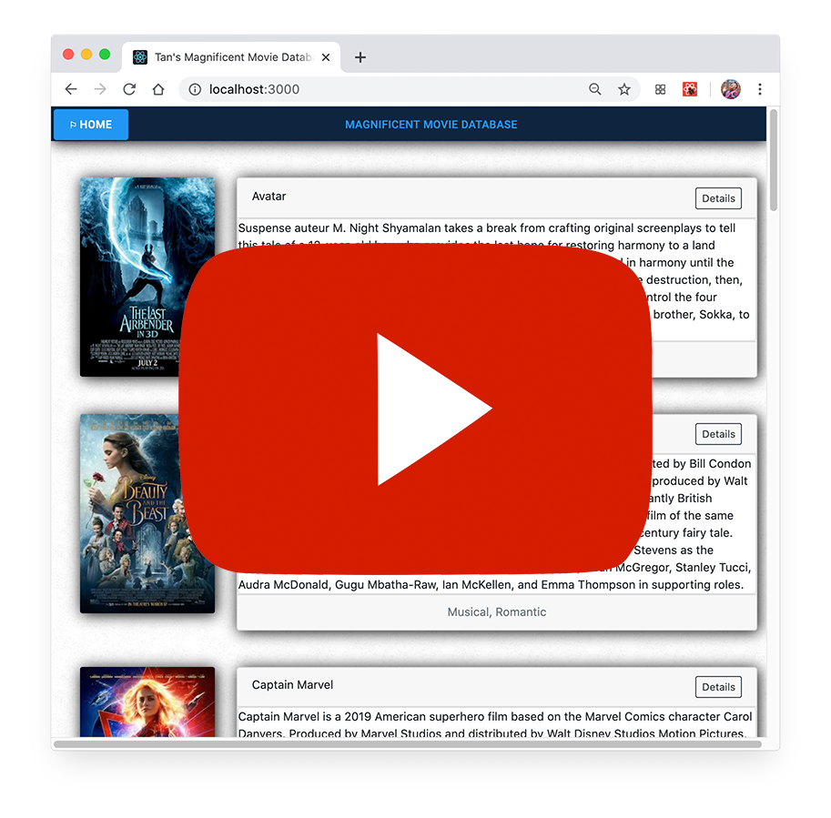
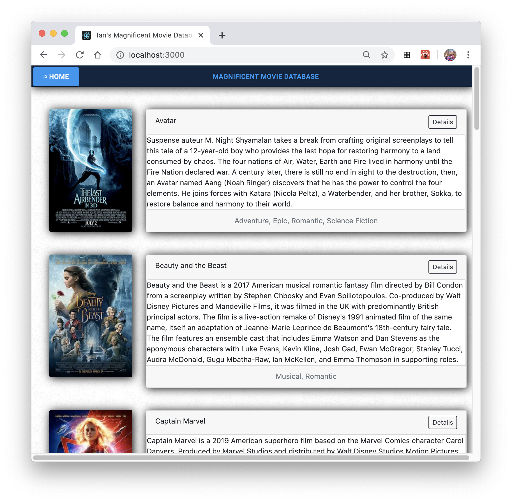
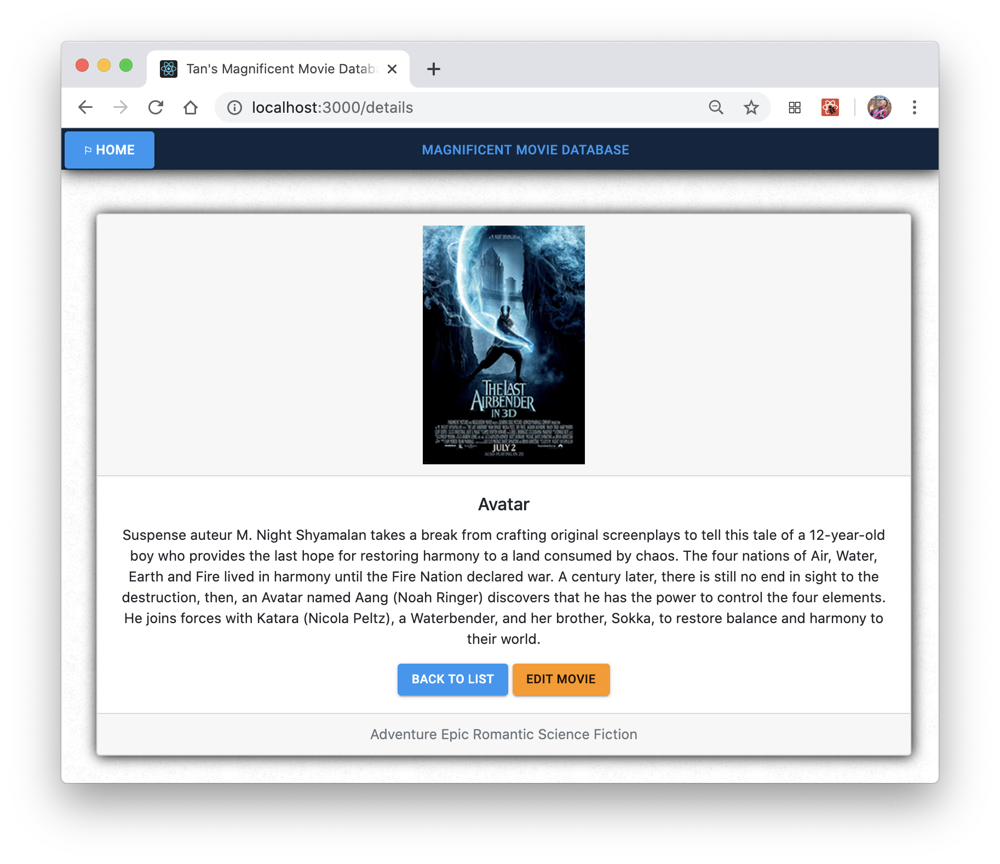
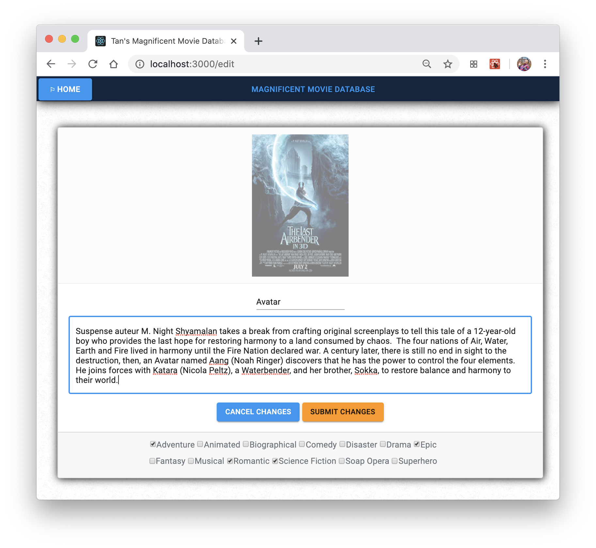

# Tan's Magnificent Movie Database

    Started May 14th, 2020
    Completed May 17th, 2020
    by Tan Van Nguyen

## Technology utilized

    React.js, Redux, HashRouter, 
    Saga, Logger, Node, Express, PostgreSQL,
    Javascript, CSS, HTML, Sweetalert2, Material-UI, Bootstrap

## Description

This weekend project required me to create a full stack movie database that utilized saga middleware.  Information is gathered using dispatches in Redux and redistributed among the other components.  Material UI, Bootstrap and SweetAlert2 was utilized to improve the aesthetics of the application.  Axios requests allowed the page to work with the SQL database to store the feedback.  Users have the ability to click for additional details and edit movies as well.

## Video of the Completed Project:

## Pictures of the Completed Project:

**The Components:**

- The *home page* contains a list of all the movies, genres associated with that movie (obtained using a junction table), and utilizes transition effects to smoothly fade between pages.

- The *details page* focuses on one item of your choosing and displays all relevant information.

- The *edit page* allows you to to modify the movie's title and description.  Note that the fields are pre-filled with the existing title, description, and genre.

- A confirmation windows appears once you press Submit Changes.

## Project Notes

This project is the culmination of all of my coding education to this point.  While I am proud of my work, I feel that with more time, I could add a lot more functionality such as a password protected administrator page that allows a user to delete entries.  I ran into problems with Material UI and intend to do more research to integrate that into future projects.  I attempted to implement the ability to add and remove genres, but it works about 75% of the time.